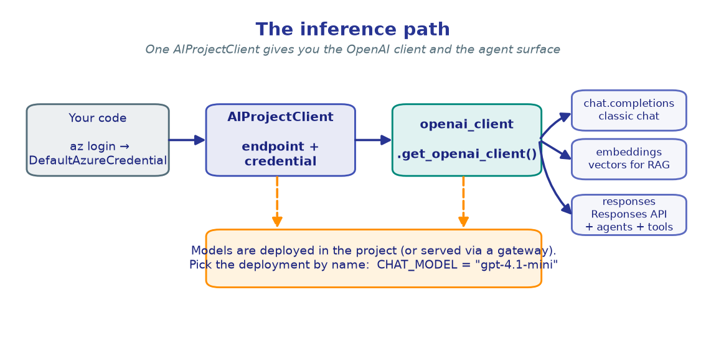
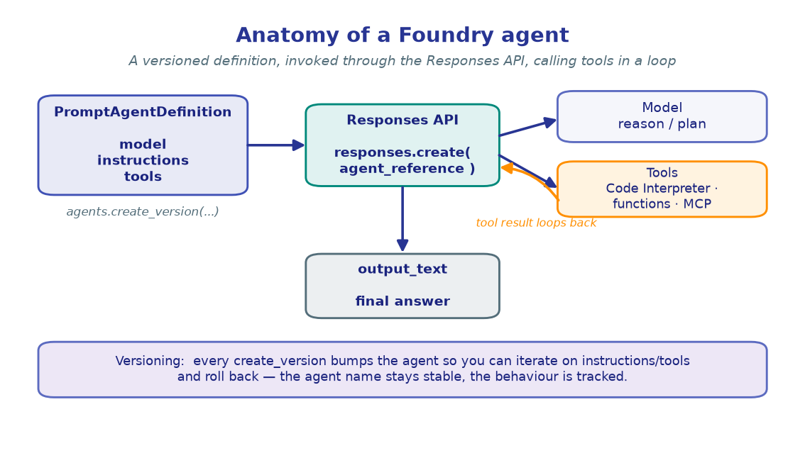
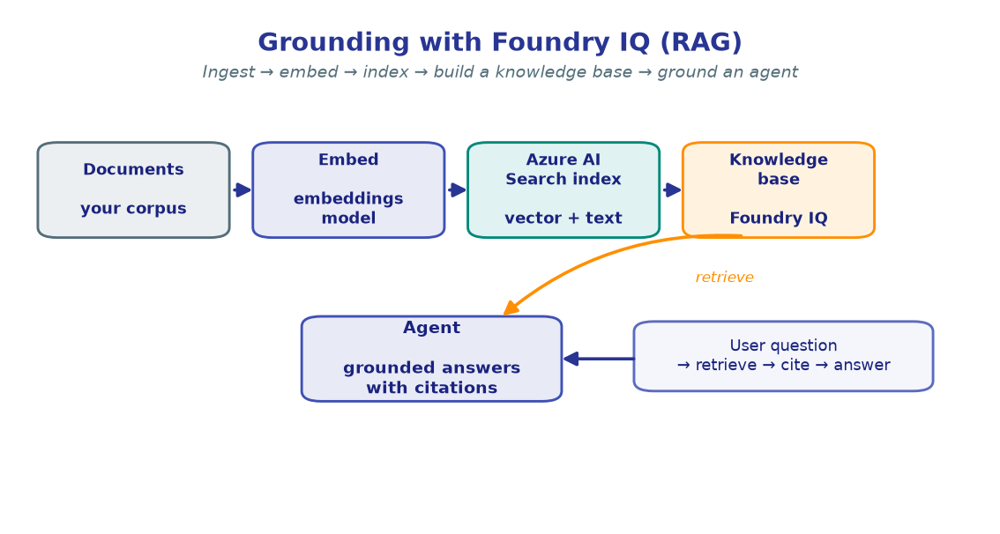
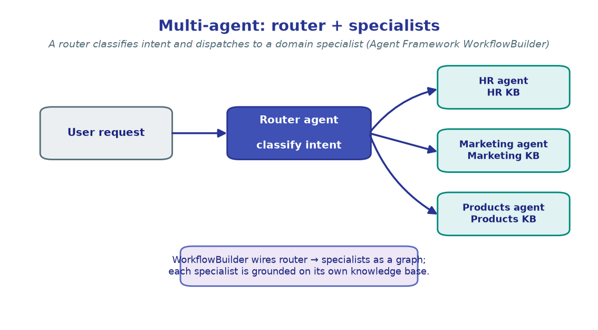
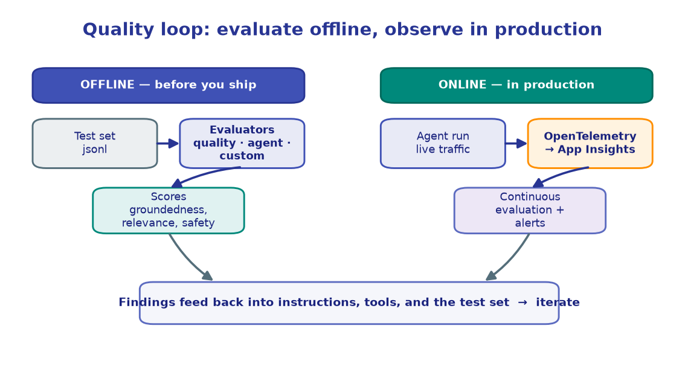

# Concepts — the mental model

This page is the thread that ties every lab together. Read it once before you start;
come back whenever a lab makes you ask *"why are we doing this?"*

The workshop has **one through-line**:

> **Start with a single model call, and end with a grounded, tool-using, evaluated,
> observable agent — all inside one Foundry project.**

Each module adds exactly one new capability to that arc.

---

## 1. Everything starts with one client

You authenticate once with **`DefaultAzureCredential`** (`az login`), build an
**`AIProjectClient`** from your project endpoint, and ask it for an OpenAI-compatible
client. That single client gives you chat, embeddings, **and** the Responses API that
powers agents.



```python
project_client = AIProjectClient(endpoint=PROJECT_ENDPOINT, credential=DefaultAzureCredential())
openai_client  = project_client.get_openai_client()
```

You build exactly this in **[M1 · First inference](modules/01-first-inference.ipynb)**,
and reuse it in every lab after.

---

## 2. From completions to *agents*

A raw model call is stateless. A **Foundry agent** wraps a model with **instructions**
and **tools** in a *versioned definition*, and you invoke it through the **Responses
API**. The model can call tools, loop on their results, and return a final answer.



- **[M2](modules/02-your-first-agent.ipynb)** — create and version an agent.
- **[M3](modules/03-tools-and-function-calling.ipynb)** — give it tools (Code
  Interpreter + your own functions).
- **[M6](modules/06-agent-memory.ipynb)** — let it remember across turns.

---

## 3. Grounding: agents that cite your data

Models hallucinate; **grounding** fixes answers to *your* corpus. You embed documents,
index them in **Azure AI Search**, build a **Foundry IQ knowledge base**, and attach it
to an agent so every answer is backed by citations.



- **[M4](modules/04-grounding-rag-foundry-iq.ipynb)** — single grounded agent.
- **[M5](modules/05-mcp-tools.ipynb)** — reach external systems through **MCP** tools.
- **[M5b](modules/05b-work-iq.ipynb)** — ground in live, permission-aware **Work IQ** (Microsoft 365) context.
- **[M8](modules/08-deep-research.ipynb)** — multi-step *research* over the corpus.

---

## 4. Scaling out: many agents, one workflow

One agent can't be expert at everything. A **router** classifies intent and dispatches
to a **specialist** — each grounded on its own knowledge base — wired together with the
Agent Framework's `WorkflowBuilder`.



You build this in **[M7 · Multi-agent orchestration](modules/07-multi-agent-orchestration.ipynb)**.

---

## 5. Trust: measure, watch, and harden

A demo agent and a *production* agent differ in one word: **trust**. Foundry bakes in
the quality loop — **evaluate offline** before you ship, **observe online** after, and
feed findings back into the agent.



- **[M9 · Evaluation](modules/09-evaluation.ipynb)** — score quality before shipping.
- **[M10 · Observability](modules/10-observability-tracing.ipynb)** — trace + evaluate
  continuously in production.
- **[M11 · Guardrails](modules/11-guardrails.ipynb)** & **[M12 · Red teaming](modules/12-red-teaming.ipynb)** —
  block unsafe content and probe for weaknesses.
- **[M13 · Human-in-the-loop & REST](modules/13-human-in-the-loop-and-rest.ipynb)** —
  require approval for sensitive actions; invoke over raw REST.

---

## 6. Going further: customize the model itself

When prompting isn't enough, **fine-tune**. In
**[M14](modules/14-fine-tuning-distillation.ipynb)** you distill a large *teacher* model
into a small, cheap *student* with LoRA/PEFT.

---

## How it all fits

```
                          ┌─────────────── one Foundry project ───────────────┐
  M1 inference  ─►  M2 agent  ─►  M3 tools  ─►  M4 grounding  ─►  M5 MCP / M6 memory
                                                     │
                                                     ▼
                                       M7 multi-agent  ─►  M8 deep research
                                                     │
                          ┌──────────────────────────┴──────────────────────────┐
                       quality & trust:  M9 eval · M10 observability · M11 guardrails
                                          M12 red-team · M13 HITL+REST · M14 fine-tune
                          └──────────────────────────┬──────────────────────────┘
                                                     ▼
                                            M15 capstone (combine it all)
```

→ Start building: **[M1 · First inference](modules/01-first-inference.ipynb)**
