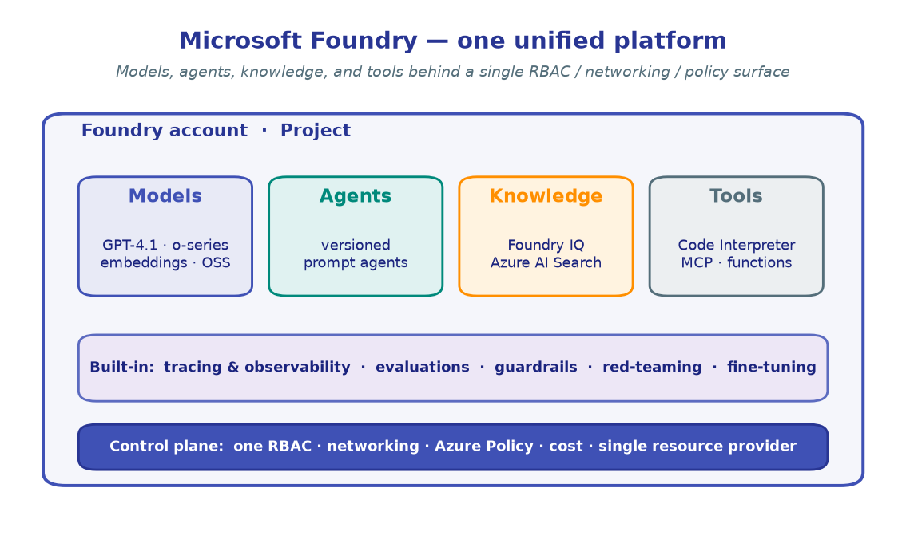

# What is Microsoft Foundry?

> **Read this first.** It frames *why* the platform exists before you start
> writing code in the labs.

**Microsoft Foundry** (Azure AI Foundry) is a unified Azure **platform-as-a-service**
for enterprise AI — it brings **models, agents, knowledge, and tools** under a single
management surface, with **tracing, evaluation, guardrails, and fine-tuning built in**.

Instead of stitching together separate services for inference, retrieval, agent
orchestration, and monitoring, Foundry unifies them under **one Azure resource
provider namespace** with a single RBAC / networking / policy surface.

---

## Why a unified platform

Building production AI used to mean assembling a zoo of services — one for model
hosting, another for vector search, a third for tracing, plus bespoke glue for
agents and guardrails. Each had its own auth, its own SKUs, its own portal.

Foundry collapses that into one platform:

| Capability | What you get | Workshop module |
|:--|:--|:--|
| **Models** | GPT-4.1, o-series reasoning, embeddings, OSS models, deployed in your project | [M1 · First inference](../modules/01-first-inference.ipynb) |
| **Agents** | Versioned prompt agents invoked via the Responses API | [M2 · Your first agent](../modules/02-your-first-agent.ipynb) |
| **Tools** | Code Interpreter, custom functions, an MCP tool catalog (1,400+ tools) | [M3 · Tools](../modules/03-tools-and-function-calling.ipynb), [M5 · MCP](../modules/05-mcp-tools.ipynb) |
| **Knowledge** | Foundry IQ knowledge bases over Azure AI Search, with citations | [M4 · Grounding/RAG](../modules/04-grounding-rag-foundry-iq.ipynb) |
| **Memory** | Cross-turn context that adapts to the user | [M6 · Agent memory](../modules/06-agent-memory.ipynb) |
| **Evaluation** | Quality, agent-specific, and custom evaluators | [M9 · Evaluation](../modules/09-evaluation.ipynb) |
| **Observability** | OpenTelemetry tracing → Application Insights | [M10 · Observability](../modules/10-observability-tracing.ipynb) |
| **Safety** | Prompt Shields, PII detection, blocklists, red-teaming | [M11 · Guardrails](../modules/11-guardrails.ipynb), [M12 · Red teaming](../modules/12-red-teaming.ipynb) |

Everything below those capabilities — RBAC, networking, Azure Policy, cost
management — is **shared**, so governance is set once and applies everywhere.

---

## The two portals

Foundry ships **two** web portals; know which one you're in:

- **Microsoft Foundry (new)** — the streamlined experience for building and operating
  **multi-agent applications**. Only **Foundry projects** are visible here. This is
  where most of this workshop's portal references point.
- **Microsoft Foundry (classic)** — use when you work across **multiple resource
  types**: Azure OpenAI resources, hub-based projects, and older project shapes.

### Three areas of the new portal

1. **Home** — project switcher and your resource boundaries at a glance.
2. **Discover** — a "Netflix-style" **catalog** of models and agents across providers
   (Azure OpenAI, OSS, partner models). Browse, compare, and deploy.
3. **Build** — the developer control plane: create projects, deploy and test models in
   playgrounds, define agents and workflows, and launch fine-tunes.

!!! tip "You'll mostly live in code"
    This is a *coding* workshop. The portal is where you **create a project and deploy
    a model** (a few clicks, covered in [Setup](../setup.md)); everything after that
    happens through the SDK in the lab notebooks.

---

## What makes it "enterprise-ready"

- **One RBAC surface** — grant access to a project, not to a dozen scattered resources.
- **Networking & Azure Policy** — private endpoints and policy guardrails apply across
  models and agents uniformly.
- **Built-in observability & evaluation** — measure quality *before* you ship and trace
  behavior *after*, without bolting on extra infrastructure.
- **Open protocols** — first-class **MCP** and **A2A** support with full auth, plus an
  AI gateway integration.
- **Fleet management** — register agents (even from other clouds), get health alerts,
  and manage 100% of your AI assets in one **Operate** view.

---

## Where this fits

The rest of the **Platform** section explains how projects and the control plane are
organized:

- **[Architecture & projects](02-architecture-and-projects.md)** — accounts, projects,
  connections, and model deployments.
- **[Control plane & governance](03-control-plane-and-governance.md)** — provisioning,
  regions, cost, RBAC, gateways, and policy.

Then the **Labs** put the platform through its paces, end to end.

→ Next: **[Architecture & projects](02-architecture-and-projects.md)**

---

!!! quote "Acknowledgement"
    Distilled from the
    [awesome-foundry-nextgen](https://github.com/corticalstack/awesome-foundry-nextgen)
    enterprise lab series (areas 00–03), simplified for a single-project coding workshop.
